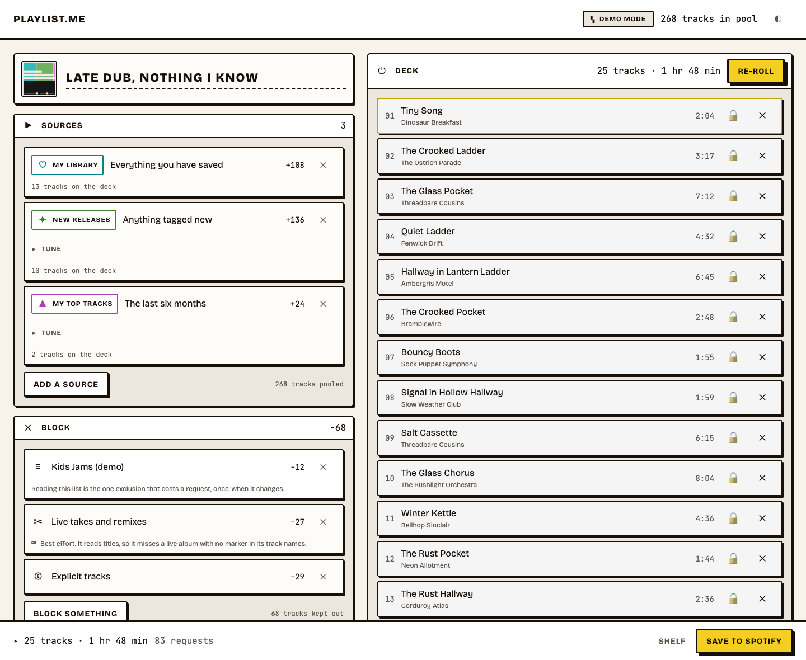
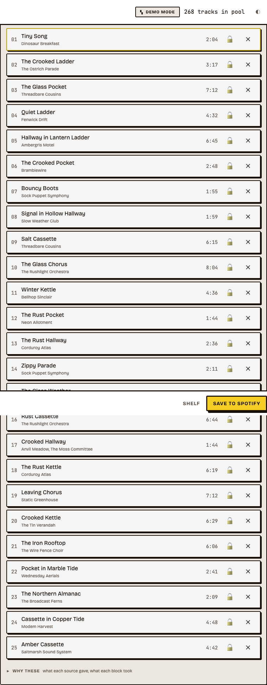
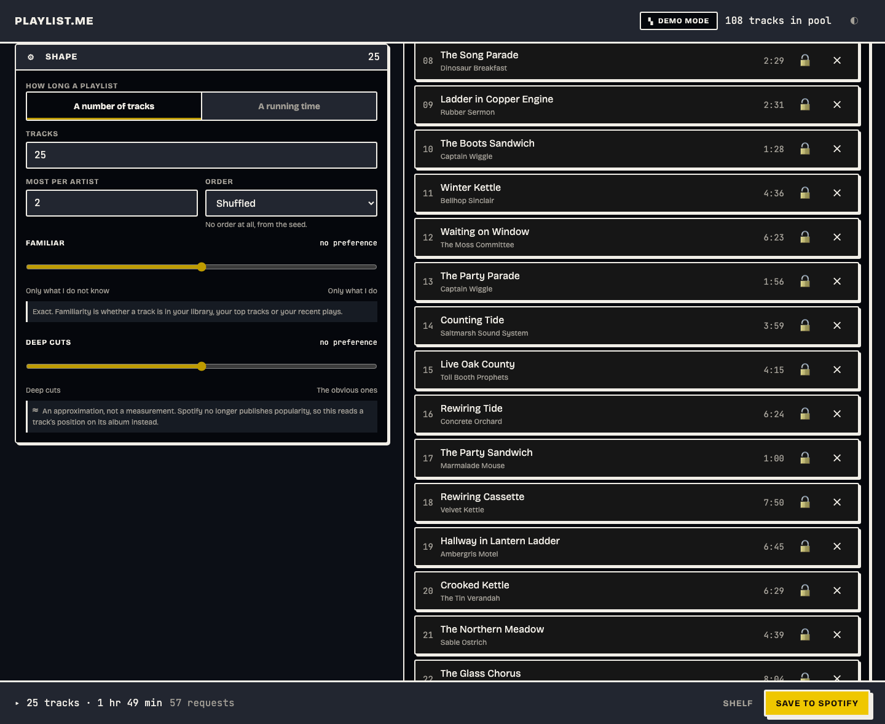

# Playlist.me

**Build Spotify playlists from inputs you choose, not from everything you have ever played.**

Spotify's own generators read your whole library and your whole listening history. If half that
history is kids' music, the generator has been quietly poisoned by an input you never chose and
cannot remove.

Playlist.me lets you say it directly: _build from these artists and this era, never touch
anything off the kids playlist, and only give me things I have not already saved._



_One bench. The recipe on the left, what it produced on the right, and the pool count moving as
you tune it. Every screenshot here is demo mode — invented artists, invented titles, no
credentials._

---

## What it does

You author a **recipe** — a small, declarative, re-runnable value:

- **Sources** — artists, tracks, a genre-and-era search, one of your playlists, your library,
  your top tracks, artists you follow, new releases.
- **Exclusions** — an artist, _everything off a given playlist_, anything already in your
  library, anything you heard recently, a year range, a duration range, explicit tracks,
  live and remix versions.
- **Shape** — how many tracks, how many per artist, how they are ordered, and two dials:
  how familiar, and how deep into each catalog.

Then you tinker. **Lock** a track and it holds its slot. **Reject** one and it never comes back.
**Re-roll** and everything else turns over. Save it to Spotify when it's right.



Re-roll costs nothing — the pool is already in hand and the engine is pure, so it never touches
the network. The locked slot holding still while the rest turn over is the whole demonstration
that a recipe plus a seed reproduces a playlist exactly.

Recipes save to your browser, export as JSON, and encode into a shareable link — a recipe plus
a seed reproduces a playlist exactly, so a link is the whole thing. There is no database.

---

## Run it

```bash
pnpm install
pnpm dev            # http://localhost:3000
```

**It runs with no credentials.** With no Spotify app configured it starts in **demo mode**,
backed by a synthetic catalog, and every feature works. That is deliberate — you should be able
to clone this and see it, not read about it.

The data in demo mode is invented. The artists are not real and the app says so.

### Connecting your own Spotify

1. Create an app at [developer.spotify.com/dashboard](https://developer.spotify.com/dashboard).
   The account that owns it **must have active Spotify Premium** — Spotify began requiring this
   for development-mode apps in February 2026.
2. Add `http://localhost:3000/api/auth/callback` as a redirect URI.
3. Under **Users and Access**, add your own Spotify account. Development mode allows **five**
   allowlisted users.
4. Copy `.env.example` to `.env.local` and fill in:

```bash
SPOTIFY_CLIENT_ID=<your client id>
SESSION_SECRET=<any 32+ character random string>
```

There is no client secret. The app uses Authorization Code with PKCE, which does not need one.

---

## Commands

```bash
pnpm dev            # web app
pnpm test           # vitest, all packages
pnpm test:e2e       # playwright, against demo mode
pnpm typecheck      # tsc --noEmit across the workspace
pnpm lint           # eslint + prettier
pnpm fix            # autofix both
pnpm check          # typecheck + lint + test
```

---

## How it is built

```
packages/core/     domain types + the recipe engine. pure. no DOM, no I/O.
packages/spotify/  the API client. interface + live impl + fake impl.
apps/web/          Next.js 16 + React 19. auth, the bench, the deck, the shelf.
```

Dependencies flow one way: **web → spotify → core**.

**The engine is a pure function.** `build({ pool, recipe, seed })` has no clock, no ambient
randomness and no network — enforced by lint, not by good intentions. Three things fall out of
that for free:

- every engine test is a plain assertion against a fixture, with no mocks and no flake
- re-roll is deterministic, so a recipe plus a seed is a complete description of a playlist,
  which is the entire share-by-link feature
- a recipe that produced something good reproduces it exactly, months later

`FakeSpotifyClient` ships beside `LiveSpotifyClient` in the same namespace. It backs demo mode,
every integration test, and the Playwright suite — which is why CI needs no credentials.

Full design, and the reasoning behind it, in
[`docs/specs/2026-08-15-playlist-me-design.md`](docs/specs/2026-08-15-playlist-me-design.md).
The interface bar is in [`docs/ui-sensibility.md`](docs/ui-sensibility.md).

---

## Why the engine is local

This is the third version of this project. v2 was a thin wrapper around Spotify's
`/recommendations` endpoint, with five sliders driven by `/audio-features`. Spotify deprecated
both on 27 November 2024, and development-mode apps lost considerably more in February 2026:

| Gone                                         | Consequence                             |
| -------------------------------------------- | --------------------------------------- |
| `/recommendations`                           | No recommendation engine to call        |
| `/audio-features`, `/audio-analysis`         | No energy, danceability, valence, tempo |
| `/artists/{id}/related-artists`              | No similarity graph                     |
| `/artists/{id}/top-tracks`                   | Walk the discography instead            |
| `/browse/new-releases`, `/browse/categories` | Use `tag:new` search instead            |
| `GET /tracks`, `/albums`, `/artists` (batch) | One request per entity                  |
| `popularity` on every object                 | No measure of how well known a track is |
| `search` with `limit=50`                     | Capped at 10 per request                |

So this version owns its recommendation logic rather than proxying someone else's. That turned
out to be the point: a local engine can honor exclusions Spotify's endpoint never accepted —
including the two that actually matter here, _never anything off this playlist_ and _nothing I
already have_.

---

## What it does not know

Two things are estimated, and the app says so wherever it shows them.

- **Depth is a proxy, not a measurement.** `popularity` no longer exists, so position within an
  album stands in for how well known a track is. Track 2 of 12 reads as prominent; track 9
  reads as a deep cut. This is a real signal and a lossy one.
- **The live/remix filter is a title heuristic.** It matches `Live`, `Remix`, `Remaster` and
  friends. It will miss a live album that isn't labelled and catch a studio track called "Live
  and Let Die".

**Familiarity, by contrast, is exact** — it is set membership in your own library, top tracks
and follows.

Both dials carry that in the interface, permanently, next to the control rather than in a
tooltip:



Other limits worth knowing: development mode caps the app at five users, `search` returns ten
results per request so large pools cost many requests (the app shows you the cost before it
spends it), and artist similarity is inferred from who appears on albums together, since
Spotify's own similarity graph is no longer exposed.

---

## License

MIT
