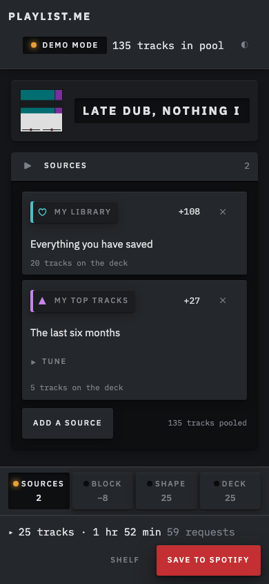
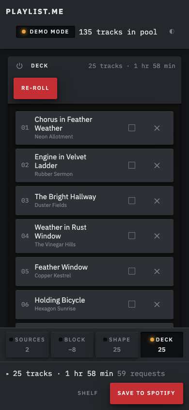
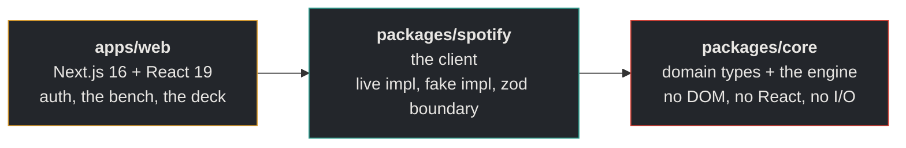
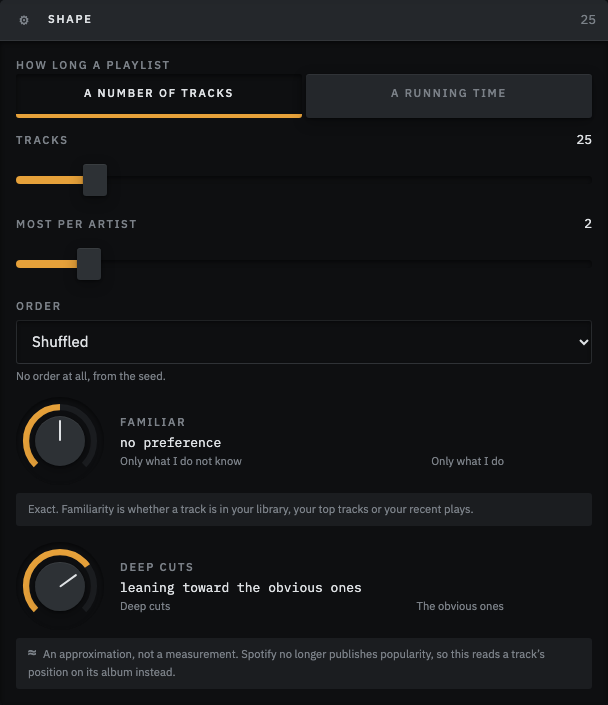
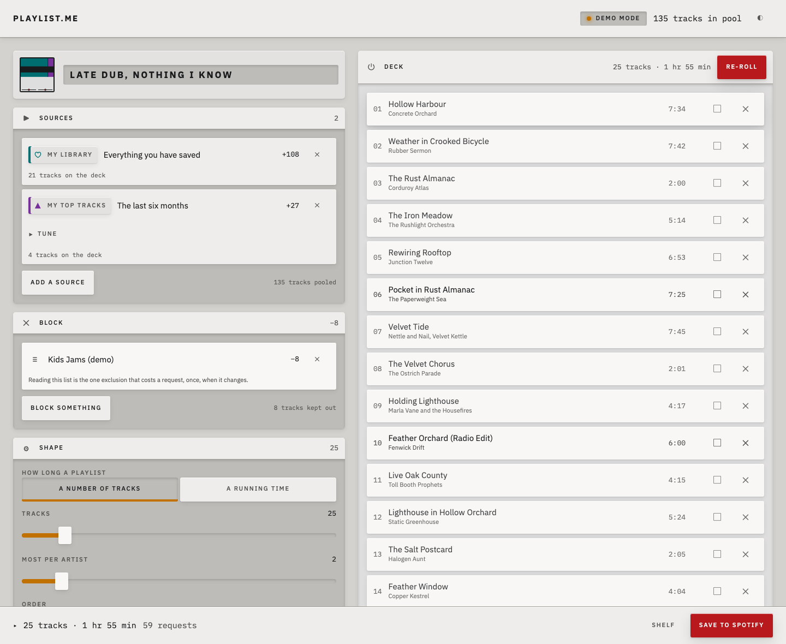
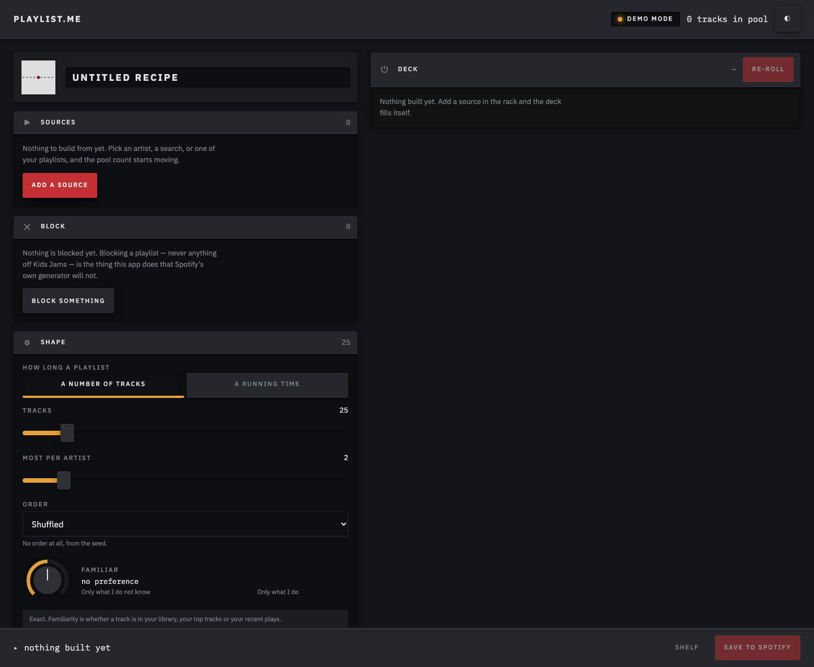

# Playlist.me

**Build Spotify playlists from inputs you choose, not from everything you have ever played.**

Spotify's own generators read your whole library and your whole listening history. If half that
history is kids' music, the generator has been quietly poisoned by an input you never chose and
cannot remove.

Playlist.me lets you say it directly: _build from these artists and this era, never touch
anything off the kids playlist, and only give me things I have not already saved._

[](https://github.com/mgballou/playlist-me-3/actions/workflows/ci.yml)


_One bench. The recipe on the left, what it produced on the right, and every number moving as you
tune it. Every screenshot here is demo mode — invented artists, invented titles, no credentials —
and every one is captured by `pnpm shots` rather than by hand._

---

## What it does

You author a **recipe**: a small declarative value naming its sources, its exclusions and its
shape.

| Part           | What goes in it                                                                                                                                                     |
| -------------- | ------------------------------------------------------------------------------------------------------------------------------------------------------------------- |
| **Sources**    | Artists, tracks, a genre-and-era search, one of your playlists, your library, your top tracks, artists you follow, new releases.                                    |
| **Exclusions** | An artist, _everything off a given playlist_, anything already in your library, anything you heard recently, a year range, a duration range, explicit, live, remix. |
| **Shape**      | How many tracks, how many per artist, how they are ordered, and two dials: how familiar, and how deep into each catalog.                                            |

Then you tinker. **Lock** a track and it holds its slot. **Reject** one and it never comes back.
**Re-roll** and everything else turns over.


Re-roll costs nothing. The pool is already in hand and the engine is pure, so it never touches the
network. The locked slot holding still while the rest turn over is the whole demonstration that a
recipe plus a seed reproduces a playlist exactly.

Recipes save to your browser, export as JSON, and encode into a shareable link. A link carries the
recipe and the seed, which is the whole playlist. There is no database.

### On a phone

Below 900px the frame stops being a bench and becomes a console: four sections, one at a time,
reached by keys under your thumb. **Each key carries its own count**, so `BLOCK −8` stays legible
while you are looking at the deck — the causal link between a change and its effect survives the
section going off-screen, which a long scroll would have broken.

| Sources                                                                                                       | Deck                                                                                                        |
| ------------------------------------------------------------------------------------------------------------- | ----------------------------------------------------------------------------------------------------------- |
|  |  |

Nothing is unmounted to do this. Every section stays alive, so the deck keeps building while it is
off-screen and its key keeps reporting what your tuning did.

---

## The vocabulary

Most of the domain model is a direct translation of the words the interface uses. If any of the
copy above was opaque, this is the decoder ring.

| Term          | What it means in the app                                                                                              | What models it                          |
| ------------- | --------------------------------------------------------------------------------------------------------------------- | --------------------------------------- |
| **Recipe**    | The unit. What gets named, saved, shared, re-run. Data only — no methods, no class.                                   | `Recipe` — `core/src/recipe.ts`         |
| **Source**    | Somewhere tracks come from. A discriminated union, never a string flag.                                               | `Source` — `core/src/recipe.ts`         |
| **Exclusion** | Something that must not appear. Applied locally, which is why "nothing off this playlist" is expressible at all.      | `Exclusion` — `core/src/recipe.ts`      |
| **Pool**      | Every track the sources resolved to, before shaping. Resolving costs requests; shaping costs nothing.                 | `TrackPool` — `core/src/domain.ts`      |
| **Deck**      | The playlist as it currently stands, and the only thing that gets written to Spotify.                                 | `BuildResult` — `core/src/build.ts`     |
| **Seed**      | One number. A recipe plus a seed is a complete description of a playlist, which is the entire share-by-link feature.  | `BuildInput.seed` — `core/src/build.ts` |
| **Lock**      | A track pinned to a slot index. Resolved twice: for membership in `select`, for position after `order`.               | `Lock` — `core/src/domain.ts`           |
| **Re-roll**   | The same `build` call with a new seed and the same locks. There is no second selection path.                          | `build` — `core/src/build.ts`           |
| **Familiar**  | Whether a track is in your library, your top tracks or your recent plays. Set membership, so it is exact.             | `familiarityOf` — `core/src/score.ts`   |
| **Depth**     | How deep into an artist's catalog a track sits. Estimated from track position, because `popularity` no longer exists. | `prominenceOf` — `core/src/score.ts`    |
| **Report**    | Why the engine chose what it chose. Returned beside the result, never instead of it.                                  | `BuildReport` — `core/src/build.ts`     |

---

## Run it

```bash
pnpm install
pnpm dev            # http://localhost:3000
```

Node 22 or newer.

**It runs with no credentials.** With no Spotify app configured it starts in **demo mode**, backed
by a synthetic catalog, and every feature works. That is deliberate: you should be able to clone
this and see it, not read about it. It is also what lets the end-to-end suite run in CI.

The data in demo mode is invented. The artists are not real, and the app says so.

### Connecting your own Spotify

1. Create an app at [developer.spotify.com/dashboard](https://developer.spotify.com/dashboard).
   The account that owns it **must have active Spotify Premium** — Spotify began requiring this
   for development-mode apps in February 2026.
2. Add `http://localhost:3000/api/auth/callback` as a redirect URI.
3. Under **Users and Access**, add your own Spotify account. Development mode allows **five**
   allowlisted users.
4. Copy `.env.example` to `.env.local` and fill in:

```bash
SPOTIFY_CLIENT_ID=<your client id>
SESSION_SECRET=<any 32+ character random string>
```

There is no client secret. The app uses Authorization Code with PKCE, which does not need one.

### Commands

```bash
pnpm dev            # web app
pnpm test           # vitest, all packages
pnpm test:e2e       # playwright, against demo mode
pnpm typecheck      # tsc --noEmit across the workspace
pnpm lint           # eslint + prettier
pnpm fix            # autofix both
pnpm check          # typecheck + lint + test
pnpm shots          # re-capture the screenshots in this file
```

---

## How it is built

A pnpm workspace, TypeScript throughout, `strict` plus `noUncheckedIndexedAccess` and
`exactOptionalPropertyTypes`.



Dependencies flow one way. `core` never imports `spotify` — barred by lint. It deals in normalized
domain types, and mapping Spotify's JSON onto them is `spotify`'s only job at the boundary.

### The engine is pure

`build({ pool, recipe, seed })` has no clock, no ambient randomness and no network. Time and seeds
enter as arguments at the boundary, enforced by lint rather than by good intentions. Three things
fall out of that for free:

- every engine test is a plain assertion against a fixture, with no mocks and no flake
- re-roll is deterministic, so a recipe plus a seed is a complete description of a playlist
- a recipe that produced something good reproduces it exactly, months later

### `build` is one function, called from every path

Initial build, re-roll, re-roll a single slot and restore-from-link are the same call with
different seeds and lock lists. A second selection path for any special case is the bug this rule
exists to prevent, and each of the four passes — `reject`, `score`, `select`, `order` — is pure and
testable on its own.

### The fake client is a real implementation

`FakeSpotifyClient` ships beside `LiveSpotifyClient` behind the same interface: 50 invented acts,
171 albums, 1,123 tracks. It backs demo mode, every integration test and the whole Playwright
suite, which is why CI needs no credentials and no network.

**1,383 unit tests across 39 files, 44 end-to-end tests across two viewports.** CI runs typecheck,
lint, tests and a production build, then runs the browser suite with no secrets configured — which
is what proves the claim that a missing `SPOTIFY_CLIENT_ID` is demo mode and not a crash.

---

## Why the engine is local

This is the third version of this project. v2 was a thin wrapper around Spotify's
`/recommendations` endpoint, with five sliders driven by `/audio-features`. Spotify deprecated both
on 27 November 2024, and development-mode apps lost considerably more in February 2026:

| Gone                                         | Consequence                             |
| -------------------------------------------- | --------------------------------------- |
| `/recommendations`                           | No recommendation engine to call        |
| `/audio-features`, `/audio-analysis`         | No energy, danceability, valence, tempo |
| `/artists/{id}/related-artists`              | No similarity graph                     |
| `/artists/{id}/top-tracks`                   | Walk the discography instead            |
| `/browse/new-releases`, `/browse/categories` | Use `tag:new` search instead            |
| `GET /tracks`, `/albums`, `/artists` (batch) | One request per entity                  |
| `popularity` on every object                 | No measure of how well known a track is |
| `search` with `limit=50`                     | Capped at 10 per request                |

So this version owns its recommendation logic rather than proxying someone else's. That turned out
to be the point: a local engine can honor exclusions Spotify's endpoint never accepted, including
the two that actually matter here — _never anything off this playlist_ and _nothing I already
have_.

---

## What it does not know

Two things are estimated, and the app says so wherever it shows them — on the panel, beside the
control, never behind a tooltip.



- **Depth is a proxy, not a measurement.** `popularity` no longer exists, so position within an
  album stands in for how well known a track is. Track 2 of 12 reads as prominent; track 9 reads
  as a deep cut. A real signal, and a lossy one.
- **The live and remix filter is a title heuristic.** It matches `Live`, `Remix`, `Remaster` and
  friends in suffix position. It will miss a live album nobody labelled.

**Familiarity, by contrast, is exact.** It is set membership in your own library, top tracks and
follows, so the interface says so plainly rather than hedging about it.

Other limits worth knowing: development mode caps the app at five users, `search` returns ten
results per request so large pools cost many requests (the app shows you the cost before it spends
it), and artist similarity is inferred from who appears on albums together, since Spotify's own
similarity graph is no longer exposed.

---

## Where things stand

**Complete and exercised end to end in demo mode.** The live client is written and unit-tested
against recorded shapes, but it has not yet been run against a real Spotify account — the app
was built credential-free on purpose, and that is the one thing being credential-free cannot
prove.

The engine is done and tested: the four passes, deterministic seeding, locks resolved in both
phases, rejects that never return, `maxPerArtist`, every exclusion kind, and a report that says
what each source gave and what each block took. Recipes serialize, round-trip through a URL, and
carry a schema version.

`apps/web` is the designed interface rather than a shell: the rack of modules, the deck, the
shelf, the knobs and faders, the paged phone layout, and a cover derived deterministically from
the recipe. Recipes live in IndexedDB and in links.

Both themes are designed rather than inverted, and the token layer has tests that convert oklch
to relative luminance and compute the WCAG ratio, so the palette is checked rather than trusted.
One of those assertions is a ceiling instead of a floor: the seam between a panel and its ground
has to stay _below_ the contrast threshold, because a border loud enough to pass for text is the
mistake the first attempt at this interface actually made.



_The same bench, same recipe, light theme. Each token declares both grounds in a single
`light-dark()`, and a parity test walks every semantic token to assert it is declared, differs
between themes, and parses in both — so a color that only got designed once fails the suite
instead of turning up in a screenshot._



_The highest-leverage screen in the app, and the one most often left blank. Every terminal state
names the next thing to do._

**Not done:** a deployment. The app is credential-free and builds clean, so it is ready to go up;
the link will land here when it does.

---

## Reading order

1. [**The design spec**](docs/specs/2026-08-15-playlist-me-design.md) — the decisions and why each
   one went the way it did, including every dead endpoint and what replaced it.
2. [**`CLAUDE.md`**](CLAUDE.md) — how to write code here. The engine's four rules, in full.
3. [**`docs/ui-sensibility.md`**](docs/ui-sensibility.md) — the interface rules, why the Console
   direction won, and what the first attempt got wrong. Normative for `apps/web`.

---

## History

Playlist.me began in 2023 as a Vite and React front end with no TypeScript and no build of its
own beyond the default, written while I was learning both. In 2024 I rebuilt it on Next 14 with
shadcn, Radix, Mongoose and axios — better tooling around the same idea, which was still: ask
Spotify's recommendation endpoint for tracks and put sliders on its parameters.

That idea stopped being available in November 2024. Both versions are early work, and this one
does not inherit their architecture, their types or their interface. What it keeps is the thing
they were reaching for: pick your own inputs, tune them, and get a playlist out.

---

## License

MIT
